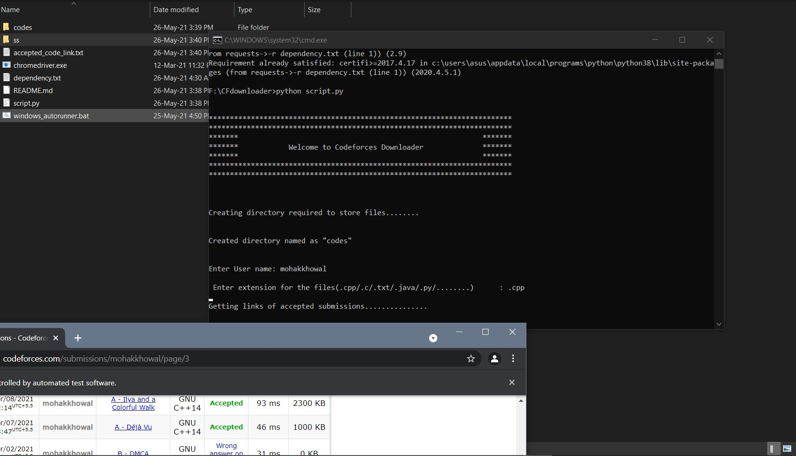
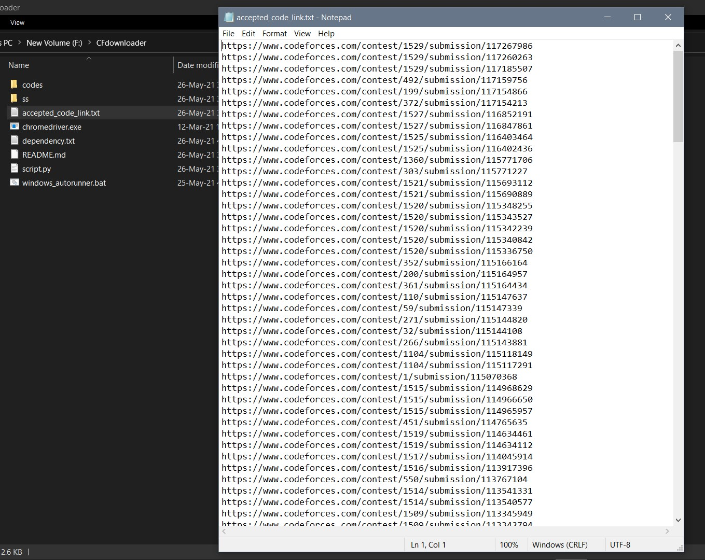
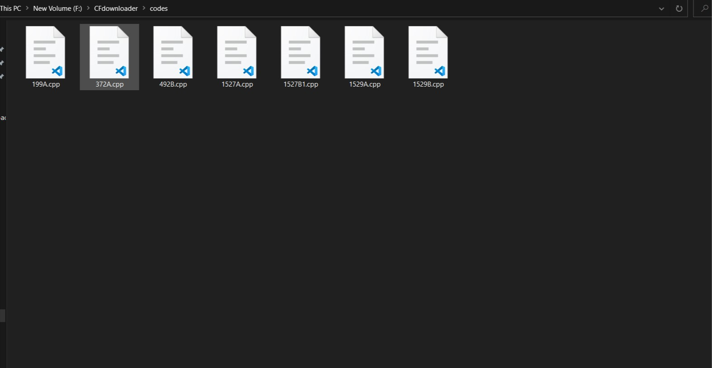

# **CODEFORCES DOWNLOADER**

### This is a python based web scraping bot for windows to download all ACCEPTED submissions of any user on Codeforces

## **Requirements :**
-- Google Chrome Installed on your System 
&nbsp; &nbsp; Check chrome version from chrome->settings->about chrome,and download chromium for same version from below link 
-- <a href = "https://chromedriver.chromium.org/downloads">Chromium</a> 
-- Clone of this repository on your System 
-- <a href = "https://phoenixnap.com/kb/how-to-install-python-3-windows">Python **3**</a> 

## **How to Run :**

Place the downloaded **"chromedriver.exe"** in the downloaded clone of this repository, click on **"windows_autorunner.bat"**, Enter Username, Enter wanted extension of the files to be saved, sit back , and relax! 😄 

## **NOTE :**
--Windows user might get warning pop-up, click on "More Info" and then "Run Anyway" button.  
--The execution time has been has been set fast. **💡For users with slow internet connection, in case you want to make the Script run slower, You can edit it in the "Script.py" file.💡** 
--Since Codeforces website gets updated frequently, you might encounter WebDriver errors. In that case, PLEASE raise an issue with related ScreenShots!

### **After successful execution :**
Your Accepted code files will be saved in "CODES" folder inside the same Folder!
 

### **Please Share with your friends, and star this repo , if you liked it!!!!**
 

### **Incase of any errors or suggestions, please feel free to contact me from contact links shared in my profile!!**
 

### **Screenshots:**
  
  
  

